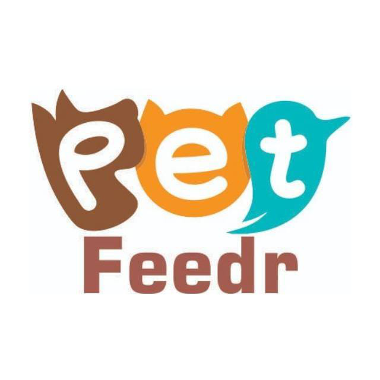

# PetFeeder

 <!-- Assumindo que há um logo, ajuste se não houver -->

Um sistema alimentador de pets baseado em IoT projetado para automatizar horários de alimentação e monitorar níveis de comida remotamente. Este projeto combina um aplicativo móvel Android com um controlador de hardware baseado em Arduino para uma experiência de usuário perfeita.

## Índice
- [Funcionalidades](#funcionalidades)
- [Tecnologias Utilizadas](#tecnologias-utilizadas)
- [Requisitos de Hardware](#requisitos-de-hardware)
- [Requisitos de Software](#requisitos-de-software)
- [Instalação](#instalação)
- [Uso](#uso)
- [Estrutura do Projeto](#estrutura-do-projeto)
- [Documentação da API](#documentação-da-api)
- [Contribuição](#contribuição)
- [Licença](#licença)
- [Contato](#contato)

## Funcionalidades

- **Alimentação Automatizada**: Agende horários e porções de alimentação via aplicativo móvel.
- **Monitoramento Remoto**: Verifique níveis do reservatório de comida usando sensores ultrassônicos.
- **Autenticação de Usuário**: Sistema de login seguro com integração Firebase.
- **Notificações em Tempo Real**: Receba alertas quando os níveis de comida estiverem baixos ou a alimentação for concluída.
- **Visualização de Dados**: Veja histórico de alimentação e estatísticas através de gráficos interativos.
- **Suporte Multi-usuário**: Gerencie múltiplos pets e usuários.
- **Capacidade Offline**: Funcionalidade básica funciona sem conexão com internet.

## Tecnologias Utilizadas

### Aplicativo Móvel (Android)
- **Linguagem**: Java
- **Framework**: Android SDK
- **Banco de Dados**: Firebase Realtime Database
- **Autenticação**: Firebase Auth
- **Componentes UI**: Material Design, Navigation Drawer, Fragments

### Controlador de Hardware (Arduino)
- **Microcontrolador**: Arduino (com Ethernet)
- **Sensores**: Sensor Ultrassônico (HC-SR04) para detecção de nível de comida
- **Atuadores**: Motor DC para dispensar comida
- **Comunicação**: Módulo Ethernet para conectividade de rede

### Backend
- **Banco de Dados**: MySQL (para dados históricos)
- **Servidor Web**: Apache/PHP (para interface web, se aplicável)
- **Serviços em Nuvem**: Firebase para dados em tempo real e notificações

## Requisitos de Hardware

- Placa Arduino com shield Ethernet
- Sensor ultrassônico (HC-SR04)
- Motor DC com driver
- Cabo Ethernet e roteador
- Fonte de alimentação para Arduino e motor
- Mecanismo de dispensação de comida (construído customizado)

## Requisitos de Software

- Android Studio (para desenvolvimento do aplicativo móvel)
- Arduino IDE (para programação do hardware)
- Conta e projeto Firebase configurados
- Servidor MySQL (opcional, para armazenamento de dados estendido)
- Java Development Kit (JDK) 8 ou superior

## Instalação

### Aplicativo Móvel
1. Clone o repositório:
   ```bash
   git clone https://github.com/VitorHugoFra/PetFeeder.git
   cd PetFeeder
   ```

2. Abra o projeto no Android Studio.

3. Configure o Firebase:
   - Crie um novo projeto Firebase no [Firebase Console](https://console.firebase.google.com/)
   - Adicione seu aplicativo Android ao projeto
   - Baixe o arquivo `google-services.json` e coloque-o no diretório `app/`

4. Compile e execute o aplicativo em um dispositivo Android ou emulador.

### Configuração do Hardware
1. Faça upload do sketch `petFeedr_projectV2.ino` para sua placa Arduino usando o Arduino IDE.

2. Conecte os sensores e motor de acordo com as definições de pinos no código:
   - Sensor ultrassônico: Pino trigger 5, Pino echo 6
   - Controle do motor: Pinos 2 e 3

3. Certifique-se de que o Arduino esteja conectado à mesma rede do seu dispositivo móvel.

### Configuração do Banco de Dados (Opcional)
- Configure um banco de dados MySQL para armazenar dados históricos de alimentação.
- Atualize as strings de conexão do banco de dados nos arquivos relevantes.

## Uso

1. **Inicie o Aplicativo**: Abra o aplicativo PetFeeder no seu dispositivo Android.

2. **Login/Cadastro**: Crie uma conta ou faça login com credenciais existentes.

3. **Configure o Perfil do Pet**: Adicione informações sobre seu(s) pet(s).

4. **Configure o Horário de Alimentação**: Defina horários, porções e intervalos de alimentação.

5. **Monitore os Níveis de Comida**: Veja o status em tempo real do reservatório de comida.

6. **Receba Notificações**: Obtenha alertas para níveis baixos de comida ou eventos de alimentação.

7. **Veja o Histórico**: Verifique logs de alimentação e estatísticas no aplicativo.

## Estrutura do Projeto

```
PetFeeder/
├── app/
│   ├── build.gradle
│   ├── proguard-rules.pro
│   └── src/
│       ├── main/
│       │   ├── AndroidManifest.xml
│       │   ├── java/com/example/
│       │   │   └── vitor/myapplication/
│       │   │       ├── activity/          # Atividades principais (Login, Principal, etc.)
│       │   │       ├── extra/             # Utilitários e receivers
│       │   │       └── fragment/          # Fragmentos de UI
│       │   └── res/                       # Recursos (layouts, drawables, etc.)
│       └── androidTest/                   # Testes de instrumentação
├── petFeedr_projectV2.ino                 # Firmware Arduino
├── build.gradle
├── settings.gradle
└── README.md
```

## Documentação da API

O aplicativo se comunica com o dispositivo Arduino via requisições HTTP pela rede local. Endpoints principais incluem:

- `GET /status`: Recupera nível atual de comida e status do sistema
- `POST /feed`: Aciona alimentação manual
- `POST /schedule`: Atualiza horário de alimentação

Para integração com Firebase, consulte a [Documentação do Firebase](https://firebase.google.com/docs).

## Contribuição

Contribuições são bem-vindas! Siga estes passos:

1. Faça um fork do repositório.
2. Crie uma branch de funcionalidade: `git checkout -b nome-da-funcionalidade`
3. Faça commit das suas mudanças: `git commit -am 'Adiciona nova funcionalidade'`
4. Faça push para a branch: `git push origin nome-da-funcionalidade`
5. Envie um pull request.

## Licença

Este projeto está licenciado sob a Licença MIT - veja o arquivo [LICENSE](LICENSE) para detalhes.

## Contato

**Vitor Hugo França de Paula**
- Email: [vitorhdepaula1@gmail.com](mailto:vitorhdepaula1@gmail.com)
- LinkedIn: [Perfil no LinkedIn](https://www.linkedin.com/in/vitorhugofra/)
- GitHub: [VitorHugoFra](https://github.com/VitorHugoFra)

---

*Este projeto foi desenvolvido como parte de uma iniciativa educacional para demonstrar conceitos de IoT na automação de cuidados com pets.*
